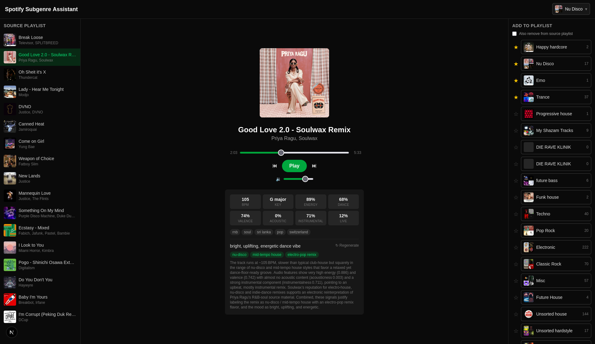

# Spotify Subgenre Assistant



A personal dashboard for triaging tracks into playlists. Point it at a messy
source playlist (a Discover Weekly dump, a "sort me later" pile, whatever),
play through it one track at a time, and let an LLM tell you what it actually
*is* — mood, vibe, and specific subgenre guesses grounded in real metadata —
before you file it into one of your own playlists.

## Why

Spotify's own genre tags are broad ("edm", "house") and don't help much when
you're trying to route tracks into a dozen different subgenre playlists. This
app pulls together everything Spotify + a couple of free APIs already know
about a track — artist genres, Last.fm tags/bio, and low-level audio features
like tempo/energy/danceability — and asks an LLM to turn that into a specific,
justified subgenre guess (e.g. "UK bass house" instead of just "house"),
without ever inventing context that isn't actually in the data.

## How it works

1. **Pick a source playlist** from the picker in the header.
2. The **left panel** lists the source playlist's tracks; the current one is
   highlighted and plays automatically via the Spotify Web Playback SDK.
3. The **center panel** shows transport controls (prev/play-pause/next) plus
   the AI-generated context for the track: mood/vibe, subgenre guesses, and
   the rationale behind them — along with the raw genres, tags, and audio
   features it was built from.
4. The **right panel** lists your playlists as filing destinations. Pin the
   ones you use most so they stay at the top. Adding a track can optionally
   remove it from the source playlist at the same time — that removal is
   deferred until you move to the next track, so you can still file the same
   track into a second or third destination first.
5. Repeat until the source playlist is empty.

## Features

- AI-generated mood/vibe + freeform subgenre labels per track, with a
  rationale that cites only the data it was actually given (no invented
  backstory, no reasoning from the track title)
- Audio features (danceability, energy, valence, tempo, key, etc.) via
  [ReccoBeats](https://reccobeats.com) — a free replacement for Spotify's own
  Audio Features endpoint, which has been closed to new apps since Nov 2024
- Optional Last.fm tags and artist bio for extra context
- Per-track and per-context-hash caching so re-visiting a track (or re-running
  a prompt tweak) doesn't re-hit the LLM or external APIs unnecessarily
- Pinnable destination playlists, with a per-track "already added here" cue
- Bring-your-own LLM key: switch between Anthropic, OpenAI, Google, Groq, or
  OpenRouter via a couple of env vars, no code changes
- Full Spotify playback control (play/pause/seek/skip) via the Web Playback
  SDK, so you can actually listen before you decide

## Tech stack

- [Next.js](https://nextjs.org) (App Router) + React 19 + TypeScript
- Tailwind CSS v4
- [iron-session](https://github.com/vvo/iron-session) for encrypted,
  cookie-based session storage (Spotify OAuth tokens)
- Spotify Web API + Web Playback SDK, [ReccoBeats](https://reccobeats.com),
  [Last.fm API](https://www.last.fm/api) — all called server-side except
  playback itself

## Setup

1. **Install dependencies**

   ```bash
   npm install
   ```

2. **Register a Spotify app** at the [Spotify Developer Dashboard](https://developer.spotify.com/dashboard).
   - Add a Redirect URI of exactly `http://127.0.0.1:3000/api/auth/callback`
     (Spotify requires the loopback IP literal, not `localhost`, for non-HTTPS
     redirect URIs).
   - Copy the Client ID and Client Secret.
   - Playback requires a **Spotify Premium** account — the Web Playback SDK
     doesn't work otherwise.

3. **Copy `.env.example` to `.env.local`** and fill in:
   - `SPOTIFY_CLIENT_ID` / `SPOTIFY_CLIENT_SECRET` from step 2.
   - `SESSION_SECRET` — any random 32+ character string (`openssl rand -base64 32`).
   - `LASTFM_API_KEY` — optional, free key from [last.fm/api](https://www.last.fm/api/account/create).
     Track context still builds without it, just without Last.fm tags/bio.
   - Nothing to configure for [MusicBrainz](https://musicbrainz.org) — its
     community-voted genres (per recording, release, and credited artist) are
     fetched with no API key. It allows ~1 request/sec, so a track's first
     load takes a few extra seconds; results are cached after that.
   - Nothing to configure for audio features (danceability/energy/valence/
     tempo/etc.) — they come from [ReccoBeats](https://reccobeats.com), a free
     replacement for Spotify's own Audio Features endpoint (closed to new
     apps since Nov 2024), no API key required. Tracks it doesn't have
     coverage for just come back with no audio features.
   - `LLM_PROVIDER` / `LLM_API_KEY` / `LLM_MODEL` — required for AI summaries.
     Bring your own key; `anthropic` is pay-as-you-go from
     [console.anthropic.com](https://console.anthropic.com) (a claude.ai Pro/Max
     subscription does NOT cover API usage — separate billing). Free tiers to
     prototype with instead are listed in `.env.example` (Google AI Studio's
     Gemini Flash, Groq, or an OpenRouter `:free` model).

4. **Run the dev server**

   ```bash
   npm run dev
   ```

   Open [http://127.0.0.1:3000](http://127.0.0.1:3000) (use `127.0.0.1`, not
   `localhost`, to match the Spotify redirect URI) and click "Connect Spotify".

## Project structure

```
src/
  app/
    api/
      auth/            # Spotify OAuth login/callback/logout/status
      playlists/       # list playlists, list/add/remove tracks
      spotify/token/   # short-lived access token for the Web Playback SDK
      track/[id]/summary/  # builds context + runs the LLM summary
    page.tsx           # entry point behind AuthGate
  components/
    Dashboard.tsx           # top-level layout + playlist/track state machine
    SourcePlaylistPanel.tsx # left: track list for the current source playlist
    NowPlayingPanel.tsx     # center: transport controls + AI context
    TrackDataPanel.tsx      # raw genres/tags/audio features display
    DestinationPlaylistsPanel.tsx  # right: pinnable filing targets
    PlayerProvider.tsx      # Web Playback SDK wrapper (client-side)
  lib/
    spotify/          # OAuth (auth.ts) + Web API client (client.ts)
    session.ts         # encrypted session cookie, token refresh
    context.ts          # buildTrackContext(): merges Spotify + Last.fm + ReccoBeats
    llm/                 # provider-agnostic summarize.ts + per-provider adapters
    reccobeats.ts, lastfm.ts   # external API clients
    cache.ts             # swappable Cache interface (in-memory today)
```

## Architecture notes

- `src/lib/spotify/` — OAuth (`auth.ts`) and Web API client (`client.ts`).
  Tokens live in an encrypted session cookie (`src/lib/session.ts`), refreshed
  transparently by `getValidAccessToken()`.
- `src/lib/context.ts` — `buildTrackContext()`: combines Spotify metadata,
  artist genres, Last.fm tags/bio, and ReccoBeats audio features into one
  object per track, cached by track ID.
- `src/lib/llm/summarize.ts` — `summarizeTrack()`: sends that context to the
  configured LLM provider and returns a structured `{ moodVibe, subgenres,
  rationale }` summary. Subgenres are freeform (not a fixed list) by design,
  and the cache key is derived from a hash of the prompt itself, so editing
  the prompt automatically invalidates stale cached summaries.
- `src/lib/cache.ts` — a small `Cache` interface with an in-memory
  implementation. Swap in a file- or DB-backed implementation later without
  touching callers.
- `src/components/PlayerProvider.tsx` — wraps the Spotify Web Playback SDK
  (loaded client-side; requires Premium). Play/pause/seek go through the
  Spotify REST API rather than the SDK instance methods, which are flakier
  about reflecting state back.

Single-user today (one session cookie, no per-user LLM key storage yet), but
built to extend to multi-user later: OAuth tokens are already per-session
rather than global, and `summarizeTrack` already takes a provider/model
argument rather than being hard-coded to one.

## Learn more about Next.js

- [Next.js Documentation](https://nextjs.org/docs)
- [Learn Next.js](https://nextjs.org/learn)
